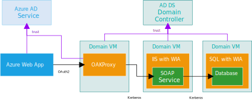
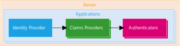
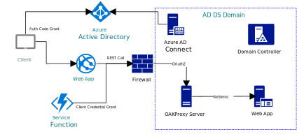

OAKProxy is an authentication protocol transitioning HTTP reverse proxy. It works in both client to service and service to service scenarios to create a bridge between modern authentication and a number of different legacy authentication mechanisms. It allows containerized, PaaS, or other modern client architectures to integrate with legacy systems using only HTTPS and modern authentication protocols.

OAKProxy is built with first class support for Azure and Azure AD throughout, but it also works with any OpenID Connect identity provider, and it runs great on-premise, in Azure Stack, or in other clouds. The entire solution is open source (MIT License) and built upon the open source .NET Core.

Legacy authentication is often a roadblock when enterprises start to modernize a legacy system using the [strangler pattern](https://docs.microsoft.com/en-us/azure/architecture/patterns/strangler). The strangler pattern advocates incrementally peeling functionality out of the legacy system in to a new environment with modern architecture. However, legacy and modern authentication do not mix well, particularly in service to service scenarios. 

## Case Study: Modernizing a Win32 Client with Azure 

Contoso is building a modern web front-end for a legacy enterprise application. The new front-end will run in Azure Web Apps. The legacy service has SOAP API that requires Windows Integrated Authentication (WIA/Kerberos). Users previously interacted with the service by running a Win32 desktop application on their domain-joined desktop. 

Contoso can not afford to upgrade the SOAP service to use modern authentication before the new front-end is built. The SOAP service has been using Kerberos constrained delegation for many years to connect to the database on-behalf-of the desktop client user. This would all have to be redesigned if the SOAP service was no longer using WIA.

For this scenario OAKProxy is installed on an AD DS domain-joined VM. This can be done physically on-premise or in Azure depending on if they have extended their AD DS domain and domain controllers in to Azure or not.

The web app has an Azure AD [managed identity](https://docs.microsoft.com/en-us/azure/active-directory/managed-identities-azure-resources), but that identity has no trust in the on-premise AD DS domain. The web app will make API calls to OAKProxy authenticated with a JWT bearer token. OAKProxy will then determine the AD DS domain user that is synchronized with the Azure AD user that interacted with the web app. Finally it will forward the request on to legacy service with a valid Kerberos ticket for the domain user. 

OAKProxy trusts Azure AD (via OIDC Discovery) and the legacy service application trusts the AD DS domain. The AD DS domain has been configured to trust OAKProxy to do authentication for select services (via Constrained Delegation). This transitively creates a trust relationship from the WIA legacy service all the way back to the web app running in Azure. With OAKProxy in place, OAuth2 and Kerberos authentication can coexist within a single system.

# Architecture

OAKProxy uses a simple request processing pipeline architecture. Incoming requests are determined by configured paths to either be anonymous, a web session, or an API call. Non-anonymous requests to OAKProxy are authenticated and authorized with OAuth2 and OpenID Connect. Any configured claims providers are then run for the request which may add, remove, or modify the available claims. Finally the request is forwarded to the backend service. The configured authenticators are responsible for modifying the request and handling any challenge/response exchange with the backend service.

## Identity Providers

Each proxied application can currently be assigned one identity provider. Available providers are:

* **Azure AD** - Supports easy configuration and rich feature integration.
* **Generic OpenID Connect** - Supports AD FS 4 or any other OpenID Connect compliant IdP.

## Claims Providers

Each proxied application can be assigned on or more claims providers. Currently there is only one claims provider, but more are planned:

* **Directory UPN Resolver** - It's not uncommon for the UPN of a user in the IdP to not match the UPN of the user in the AD DS domain (in Azure AD this is known as alternate logon ID). The provider can look up the UPN by SID in the current domain or an AD LDS instance. It can also be used to map IdP service principals to domain users or domain service accounts.

## Authenticators

Each proxied application can be assigned one or more authenticators.  Available authenticators are:

* **Kerberos** - Any domain user or service account can be impersonated based on an incoming UPN claim to the authenticator. This claim may be directly from the IdP or from a claims provider.
* **Headers** - Any arbitrary transformation of the available claims to HTTP headers is possible. There is no limitation by syntax or functions available because transforms can be written in the C# Script programming language.
* **Bearer** - For REST APIs the original unmodified access_token can be passed to the service. For web browser sessions, the original id_token can be passed as a bearer token.

# Kerberos and Corporate Networks

The Kerberos authenticator allows clients of Windows Integrated Authentication services to be properly segregated from the corporate network. Neither end-user clients nor service applications require connectivity to AD DS. OAKProxy sits inside the corporate network on a server joined to the AD DS domain. The only ingress required to OAKProxy is HTTPS. Typically HTTPS will be terminated at an application delivery controller (e.g. Azure Application Gateway, F5, etc.) and an HTTP connect will be forwarded to OAKProxy. The HTTP connection will bear a JWT token obtained from the modern identity provider. A Kerberos token is retrieved for the user identified by the JWT (using constrained delegation, S4U2Self) and used to forward the request to a backend (using S4U2Proxy). Backend applications require zero modification as the proxied request will look just like one coming from a domain-joined client. Backends can also use constrained delegation themselves (i.e. triple hop).

# Azure AD Application Proxy

OAKProxy provides similar functionality to [Azure AD Application Proxy](https://docs.microsoft.com/en-us/azure/active-directory/manage-apps/application-proxy). Application Proxy is a fully managed PaaS service. An Azure AD Basic or Premium license is required for each user of Application Proxy.

Feature | OAKProxy | Azure AD App Proxy
--- | --- | ---
JWT Pre-Authentication | Yes | User Only
PaaS Frontend | No | Yes
Outbound Tunneling | No | Yes
Multi-Region Ingress | Deployable | No
Open Source | Yes | No
Service Principal KCD | Yes | No
License Required | No | Yes
Header-based Authentication | Yes | With Ping Access
Supported IdPs | Any OIDC | Azure AD

# Resources

* [Documentation](https://github.com/wpbrown/oakproxy/blob/master/docs/README.md)
* [Downloads](https://github.com/wpbrown/oakproxy/releases)
* [Official Docker Images](https://hub.docker.com/r/rebeagle/oakproxy)
* [Development Lab](https://github.com/wpbrown/oakproxy/tree/master/testenv)
* [Project Roadmap](https://github.com/wpbrown/oakproxy/projects/2)
* [Wiki](https://github.com/wpbrown/oakproxy/wiki)
