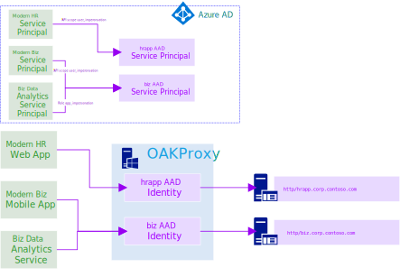

<hr/>

[](https://dev.azure.com/rebeagle/oakproxy/_build/latest?definitionId=7&branchName=master)

OAKProxy is an authentication protocol transitioning reverse proxy. It can authenticate incoming API requests with OAuth2 and web requests with OpenID Connect and transition that authentication to Kerberos, header-based authentication, or JWT bearer for downstream services. It allows containerized, PaaS, or otherwise non-domain clients to integrate with legacy domain systems using only HTTPS and modern authentication. 

Neither end-user clients nor applications require connectivity to AD DS. Incoming connections are authorized with JWT bearer tokens obtained from the modern identity provider. A Kerberos token is retrieved for the user identified by the JWT (using constrained delegation, S4U2Self) and used to forward the request to a backend (using S4U2Proxy). Backend applications require zero modification as the proxied request will look just like one coming from a domain-joined client. Backends can also use constrained delegation themselves.


AD domain authentication is often a roadblock when enterprises attempt to start modernizing a legacy system using the [strangler pattern](https://docs.microsoft.com/en-us/azure/architecture/patterns/strangler). The strangler pattern advocates incrementally peeling functionality out of the legacy system in to a new environment. However, legacy and modern authentication do not mix. A service running in Azure with an Azure AD security principal has no trust in the AD domain. OAKProxy is a gateway that allows the AD domain to trust Azure AD identity. With OAKProxy, modern and legacy authentication can coexist in a single system.

## Features

* A single instance can proxy any number of applications.
* Stateless. Can be deployed in a highly-available configuration.
* Translate user identities (token acquired via auth code grant) to domain users.
* Translate application identities (token acquired via client credential grant) to domain users.
* Each AD domain application gets a unique identity with roles and scopes in Azure AD.

## Azure AD Application Proxy

OAKProxy provides similar functionality to [Azure AD Application Proxy](https://docs.microsoft.com/en-us/azure/active-directory/manage-apps/application-proxy). Application Proxy is a fully managed PaaS service. An Azure AD Basic or Premium license is required for each user of Application Proxy.

Feature | OAKProxy | Azure AD App Proxy
--- | --- | ---
JWT Pre-Authentication | Yes | User Only
PaaS Frontend | No | Yes
Outbound Tunneling | No | Yes
Multi-Region Ingress | Deployable | No
Open Source | Yes | No
Service Principal KCD | Yes | No
License Required | No | Yes
Header-based Authentication | Yes | With Ping Access

# Documentation

- [Documentation](#documentation)
- [Security](#security)
  - [Mitigation](#mitigation)
- [OAuth2](#oauth2)
  - [User Impersonation](#user-impersonation)
  - [Service Accounts](#service-accounts)
- [OpenID Connect](#openid-connect)
- [Identity Translation](#identity-translation)
  - [Users](#users)
  - [Applications](#applications)
- [Deployment Scenarios](#deployment-scenarios)
  - [High Availability](#high-availability)
- [Prerequisites](#prerequisites)
  - [Kerberos](#kerberos)
  - [Service Account](#service-account)
    - [Configure a gMSA for Constrained Delegation](#configure-a-gmsa-for-constrained-delegation)
- [Installation](#installation)
- [Uninstallation](#uninstallation)
- [Azure AD Application Configuration](#azure-ad-application-configuration)
  - [Register Applications in Azure AD](#register-applications-in-azure-ad)
    - [Configure API Access](#configure-api-access)
    - [Configure Web Access](#configure-web-access)
      - [Require User Assignment](#require-user-assignment)
      - [Disable Implicit ID Tokens](#disable-implicit-id-tokens)
  - [Manual Application Setup](#manual-application-setup)
    - [Expose an API Scope](#expose-an-api-scope)
    - [Optional Claims for Alternate Logon ID](#optional-claims-for-alternate-logon-id)
    - [Optional Claims for B2B Users](#optional-claims-for-b2b-users)
    - [Optional Claim for OpenID sessions](#optional-claim-for-openid-sessions)
- [OAKProxy Configuration](#oakproxy-configuration)
  - [Configuration File Schema](#configuration-file-schema)
    - [Server Object](#server-object)
    - [Azure Key Vault Object](#azure-key-vault-object)
    - [Certificate File Object](#certificate-file-object)
    - [Certificate Store Reference Object](#certificate-store-reference-object)
    - [Azure AD Identity Provider Object](#azure-ad-identity-provider-object)
    - [Kerberos Authenticator Object](#kerberos-authenticator-object)
    - [Service Principal Mapping Object](#service-principal-mapping-object)
    - [Headers Authenticator Object](#headers-authenticator-object)
    - [Headers Definition Object](#headers-definition-object)
    - [Application Object](#application-object)
    - [Path Authentication Option Object](#path-authentication-option-object)
    - [Azure AD Identity Provider Binding Object](#azure-ad-identity-provider-binding-object)
    - [Kerberos Authenticator Binding Object](#kerberos-authenticator-binding-object)
    - [Headers Authenticator Binding Object](#headers-authenticator-binding-object)
    - [Subsystem Configuration](#subsystem-configuration)
  - [Header Expressions](#header-expressions)
  - [Example Configuration](#example-configuration)
    - [HTTPS](#https)
- [Troubleshooting](#troubleshooting)
- [Roadmap](#roadmap)

# Security

Because the service account that runs OAKProxy is trusted for delegation, the account and the machine that runs the service should be considered part of your [Tier 0 identity infrastructure](https://docs.microsoft.com/en-us/windows-server/identity/securing-privileged-access/securing-privileged-access-reference-material). 

## Mitigation

The service account should always be configured for *constrained* delegation. This limits OAKProxy's ability to impersonate users only to a list of services maintained by a privileged user such as a Domain Admin or service admins in the case of resource-based constrained delegation.

Using a gMSA is recommended to limit the potential for abuse of the privileged service account. This applies to all privileged service accounts, not just OAKProxy.

The service account requires no special rights (e.g. SeTcbPrivilege, SeImpersonatePrivilege) on the host machine which limits exposure. The service account only has the ability to impersonate to the specific service principals defined in the constrained delegation configuration in AD DS.

# OAuth2

Each application proxied by OAKProxy is represented by a unique application registration in Azure AD. Client applications consume proxied APIs like any other API protected by modern authentication. There is no indication to the consumer that this is a proxied API.

There is a prototypical app registration for proxied apps. The apps must have exactly one scope defined: `user_impersonation` and one role which applications are eligible for: `app_impersonation`.



## User Impersonation

An application can acquire a JWT token that will allow it to call a proxied API which in the end reaches the backend as the domain identity of the user represented by the token. This is done via the auth code grant flow. Either the user or an admin of the user's tenant must first consent the `user_impersonation` scope to the application.

## Service Accounts

An application can acquire a JWT token that will allow it to call a proxied API which in the end reaches the backend as the domain identity of an account configured in OAKProxy. This is done via the client credential grant. Either the owner of the API or an admin of the API's tenant must first grant the `app_impersonation` role to the application.

# OpenID Connect

Applications proxied by OAKProxy can be directly accessed by users with a web browser. OAKProxy will authentication the user with OpenID Connect and establish a session with a cookie.

If the users signs out of Azure AD, they will be automatically signed out of the OAKProxy applications as well.

# Identity Translation

There are 2 Azure AD identity types that OAKProxy will translate to domain identities: user principals and application service principals.

## Users

In the simplest scenario, the domain is being synchronized to Azure AD by Azure AD Connect. The Azure AD UPN is equivalent to the AD DS UPN. The `upn` claim of the incoming access JWT token will simply be looked up in AD DS.

Not all environments use the AD DS UPN to populate the Azure AD UPN (e.g. AD `mail` attribute is sometimes used for the cloud UPN). This is known as [alternate login ID](https://docs.microsoft.com/en-us/windows-server/identity/ad-fs/operations/configuring-alternate-login-id). In this scenario you must configure [optional claims](#optional-claims-for-alternate-logon-id) for each of your applications. This will cause Azure AD to include the `onprem_sid` claim in the access token. OAKProxy will use this claim to look up the user in AD DS by their SID. 

## Applications

In hybrid environments, AD DS service accounts have no synchronization relationship with Azure AD service principals. In OAKProxy you can establish the relationship by manually mapping Azure AD service principals to AD DS accounts. In addition to users, the AD DS account can be a gMSA or Computer, but they must be assigned a userPrincipalName. 

# Deployment Scenarios

OAKProxy can be deployed on-premise or in Azure. When OAKProxy is deployed on-premise traffic can arrive from Azure via your corpnet (VPN/ER) or directly via the internet through a corporate firewall. If you deploy OAKProxy in an [Azure VDC](https://docs.microsoft.com/en-us/azure/architecture/vdc/), it can act as a bridge between your domain and non-domain network segments entirely in Azure, or direct traffic from non-domain segments back to on-premise backends via VPN/ER. 

The server can and should be deployed behind an on-premise firewall, Azure Application Gateway, Azure API Management, or an NVA if it receives traffic from outside corpnet.

The server can be run on an account or host with highly constrained or no outbound internet access. It only communicates outbound to Azure AD metadata endpoints (periodically) and the backends that you configure. If OAKProxy has no outbound internet access you must provide Azure AD metadata to the application manually via configuration and you are responsible for keeping it up to date.

## High Availability

OAKProxy is a stateless proxy. Any number of instances can be load-balanced. 

A load-balancer can evaluate the health by looking for a 200 response from `/.oakproxy/health`.

# Prerequisites

The only prerequisites for the software installation are what is [required for .NET Core](https://docs.microsoft.com/en-us/dotnet/core/windows-prerequisites). For Windows Server 2016 or higher this means nothing additional is required.

## Kerberos

Kerberos access to your service must already be fully functional on your domain. Check the 'Security' Event Log on the server hosting the service you want to proxy for. Look for Event ID 4624 Logon 'Audit success'. If the details for the event look like below, then at least some clients are not authenticating with Kerberos and you may experience authentication failures with OAKProxy. Ensure that your service has an A record in DNS and the corresponding [SPNs](https://docs.microsoft.com/en-us/windows-server/security/group-managed-service-accounts/getting-started-with-group-managed-service-accounts) are configured properly.
```
Detailed Authentication Information:
    Logon Process:		NtLmSsp 
    Authentication Package:	NTLM
    Transited Services:	-
    Package Name (NTLM only):	NTLM V2
    Key Length:		128
```
A proper authentication event looks like below:
```
Detailed Authentication Information:
    Logon Process:		Kerberos
    Authentication Package:	Kerberos
    Transited Services:	-
    Package Name (NTLM only):	-
    Key Length:		0
```

## Service Account

A user account, MSA, or gMSA must already created and configured to run the OAKProxy service. The service account must be trusted for "any protocol" constrained delegation to any of the backend services you intend to proxy. gMSA is the recommended service account type if your environment supports it.

Ensure the service account has rights to logon as a service on the host server. If OAKProxy is directly serving HTTPS and you are using a cert in the system store, make sure the service account has access to the certificate.

### Configure a gMSA for Constrained Delegation

Given `oakproxyComputerName` to be the name of the server hosting OAKProxy and `proxiedServiceSpns` to be the SPNs of the services being proxied to, below will create a gMSA to run OAKProxy. This assumes your domain is already [setup for gMSAs](https://docs.microsoft.com/en-us/windows-server/security/group-managed-service-accounts/create-the-key-distribution-services-kds-root-key). In a Highly Available deployment of OAKProxy, `$server` would be set to an AD Group that contains all the computer objects hosting OAKProxy, not a single computer object.
```PowerShell
$oakproxyComputerName = '...'
$proxiedServiceSpns = @('http/app1','http/app1.corp.contoso.com', '...')
$server = Get-ADComputer $oakproxyComputerName
New-ADServiceAccount -Name 'xgoakproxy' ` 
    -PrincipalsAllowedToRetrieveManagedPassword $server `
    -ServicePrincipalNames 'http/xgoakproxy' `
    -DNSHostName 'xgoakproxy.corp.contoso.com'
$gmsa = Get-ADServiceAccount -Identity 'xgoakproxy'
$gmsa | Set-ADAccountControl -TrustedToAuthForDelegation $true
$gmsa | Set-ADServiceAccount -Add @{'msDS-AllowedToDelegateTo' = $proxiedServiceSpns}
```

# Installation

1. Extract the release .zip on a local drive.
2. Open an administrator PowerShell in the extracted directory.
3. `Import-Module .\OAKProxy.psm1` .\
   If you get an execution policy error you need to adjust temporarily `Set-ExecutionPolicy Bypass -Scope Process` . 
4. Configure the service by creating `oakproxy.yml` in the directory with the OAKProxy binaries.
5. Run `Install-OAKProxy` and supply the credential that the service will run with. This will install and start the service. If the credential is for a gMSA, leave the password blank.

# Uninstallation

1. Open an administrator PowerShell in the installation directory.
2. `Import-Module .\OAKProxy.psm1` .
3. Run `Uninstall-OAKProxy` to stop and delete the service.
4. Delete installation directory.

# Azure AD Application Configuration

Each application proxied by OAKProxy has a unique application registration in Azure AD. Applications can be registered like any other application using the portal ([old](https://docs.microsoft.com/en-us/azure/active-directory/develop/quickstart-v1-add-azure-ad-app), [new](https://docs.microsoft.com/en-us/azure/active-directory/develop/quickstart-register-app)), PowerShell, or the CLI. The recommend approach is to use the provided script to initialize your application.


## Register Applications in Azure AD

On a local *nix shell or the Azure Cloud Shell download the helper script. This script will bootstrap an application registration with the appropriate roles, scopes, and claims.

```shell
will@Azure:~$ wget "https://raw.githubusercontent.com/wpbrown/oakproxy/master/src/deploy/create-oakproxy-app.sh"
...
will@Azure:~$ chmod 755 create-oakproxy-app.sh
```

Now you can create a new application. The only argument is an display name. Be sure to use a new unique application name in your tenant:
```shell
will@Azure:~$ ./create-oakproxy-app.sh "Contoso HR"
Creating application...
Created object '4ca2ea89-3b02-4e05-bfd0-fb44d9bc3868'.
Updating application...
Updated application.
Success!
```

The application can be used to proxy web-based access, REST API access, or both to the application server. Additional configuration needed for each scenario is described in the following sections.

### Configure API Access

To access your application as an API with bearer authentication you must configure a meaningful application identifier:
```shell
will@Azure:~$ az ad app update --id 4ca2ea89-3b02-4e05-bfd0-fb44d9bc3868 --identifier-uris "https://contoso.com/api/hr"
```

Add the identifier to the OAKProxy application configuration:
```yaml
Applications:
- Name: contoso_hr
  IdentityProviderBinding:
    Name: contoso_tenant
    ClientId: '44fdea5b-67a2-48e4-9e0a-851f3a541024'
    AppIdUri: 'https://contoso.com/api/hr'
```

### Configure Web Access

To access your application as a web application you must configure the homepage, callback, and remote logout URLs in the application registration. The hostname used should be consistent with the hostname configured for the application in OAKProxy. The reply and logout URLs are always at `/.oakproxy/login` and `/.oakproxy/logout` on the configured application host.

```shell
will@Azure:~$ az ad app update --id 4ca2ea89-3b02-4e05-bfd0-fb44d9bc3868 \
  --homepage "https://hr.contoso.com" \
  --reply-urls "https://hr.contoso.com/.oakproxy/login" \
  --set "logoutUrl=https://hr.contoso.com/.oakproxy/logout"
```

#### Require User Assignment

By default, any valid user of your tenant who logs in to the application via the web will be allowed and OAKProxy will attempt to transition their identity to the backend. OAKProxy can be configured to perform authorization for web users.

Add the `WebRequireRoleClaim` to the application:
```yaml
Applications:
- Name: contoso_hr
  WebRequireRoleClaim: true
```

OAKProxy will now require the user who logs directly in the application via the web to have the `user_web` role in their token. You must [assign the role to users](https://docs.microsoft.com/en-us/azure/active-directory/manage-apps/methods-for-assigning-users-and-groups#assign-users) or [groups](https://docs.microsoft.com/en-us/azure/active-directory/manage-apps/methods-for-assigning-users-and-groups#assign-groups) to allow them access to the application. Select the "Web User" role (which was created by the application script).

For extra protection, you can [require user assignment](https://docs.microsoft.com/en-us/azure/active-directory/manage-apps/methods-for-assigning-users-and-groups#prerequisites) which perform authorization in Azure AD.

#### Disable Implicit ID Tokens

It's standard practice to use an implicit id_token response for OpenID Connect web authentication. If you need to require use of auth code grant for authentication, OAKProxy supports this.

First disable implicit ID tokens in your application registration:
```shell
will@Azure:~$ az ad app update --id 4ca2ea89-3b02-4e05-bfd0-fb44d9bc3868 --set oauth2AllowIdTokenImplicitFlow=false
```

You must add a client secret to use the auth code grant:
```shell
will@Azure:~$ az ad app credential reset --id 4ca2ea89-3b02-4e05-bfd0-fb44d9bc3868
{
  "appId": "44fdea5b-67a2-48e4-9e0a-851f3a541024",
  "name": "48013783-c898-4b22-a46a-91f0bcf0ff1c",
  "password": "533e7282-dcdf-49aa-b0b1-e391ddea62c3",
  "tenant": "84a3c4da-5d91-4223-abb7-2a9e961bb726"
}
```

Now update the OAKProxy configuration by adding `ClientSecret` and `DisableImplicitIdToken` to the `IdentityProviderBinding` for the application:
```yaml
Applications:
- Name: contoso_hr
  IdentityProviderBinding:
    Name: contoso_tenant
    ClientId: '44fdea5b-67a2-48e4-9e0a-851f3a541024'
    ClientSecret: '533e7282-dcdf-49aa-b0b1-e391ddea62c3'
    DisableImplicitIdToken: true
```

## Manual Application Setup

If you don't use the script, there is some additional configuration that may be necessary for your application.

### Expose an API Scope

If you use the AzureAD PowerShell command, the Azure CLI (the recommended script uses this), or the _old_ portal UI the default `user_impersonation` scope is created for you. Otherwise you need to add it to the [application manifest](https://docs.microsoft.com/en-us/azure/active-directory/develop/reference-app-manifest) (you must generate a new UUID for the role):
```json
"oauth2Permissions": [
    {
      "adminConsentDescription": "Allow the application to access Contoso HR API on behalf of the signed-in user.",
      "adminConsentDisplayName": "Access Contoso HR API",
      "id": "12345678-1234-1234-1234-123456789012",
      "isEnabled": true,
      "type": "User",
      "userConsentDescription": "Allow the application to access Contoso HR API on your behalf.",
      "userConsentDisplayName": "Access Contoso HR API",
      "value": "user_impersonation"
    }
  ]
```

### Optional Claims for Alternate Logon ID

When you use alternate logon ID, you must enable the on-premise SAM ID claim so OAKProxy can look up on the AD DS user. Add the following section to the [application manifest](https://docs.microsoft.com/en-us/azure/active-directory/develop/reference-app-manifest):
```json
"optionalClaims": {
    "accessToken": [
      {
        "name": "onprem_sid",
        "essential": false
      }
    ]
  }
```

### Optional Claims for B2B Users

The UPN claim is not available by default for B2B users. Add the following section to the [application manifest](https://docs.microsoft.com/en-us/azure/active-directory/develop/reference-app-manifest) so the application receives the B2B external UPN:
```json
"optionalClaims": {
    "accessToken": [
      {
        "name": "upn",
        "essential": true,
        "additionalProperties": [
          "include_externally_authenticated_upn"
        ]
      }
    ]
  }
```

### Optional Claim for OpenID sessions

The session ID claim is required for the proxy to validate remote logout attempts are legitimate. Currently this also requires a `None` same site policy so remote sign out requests sends the session cookie. This is a limitation of Azure AD.

```json
"optionalClaims": {
  "idToken": [
    {
      "name": "sid", 
      "essential": false
    } 
  ]
},
```

# OAKProxy Configuration

Configuration is loaded from the following locations in order of precedence with the first being highest precedence:

Source | Description
--- | --- 
Environment Variables | Environment must be prefixed with `O_`. Environment variables use `__` as a separator. Example: `O_Server__Urls`.
Azure Key Vault | If Azure Key Vault is configured. Key Vault use separator `--`. For example: to configure the ClientSecret for the first identity provider binding in the first application name the secret: `Applications--0--IdentityProviderBindings--0--ClientSecret`.
Working Directory YAML | `oakproxy.yml` if it exists in the current working directory.
Installation Directory YAML | `oakproxy.yml` if it exists in the directory where the OAKProxy executable is installed.
Key Per File Directory | Each file in the directory represents a key and the content of the file is the value. This uses `__` as a separator. The directory is `/etc/oakproxy/config` on Linux and typically `C:\ProgramData\oakproxy\config` on Windows or `C:\oakproxy\config` in a Windows Container. This supports using Kubernetes ConfigMaps and Secrets.
Configuration Directory YAML | `oakproxy.yml` if it exists in the system configuration directory: `/etc/oakproxy` on Linux and typically `C:\ProgramData\oakproxy` on Windows or `C:\oakproxy` in a Windows Container.

## Configuration File Schema

Name | Default | Description
--- | --- | ---
**Server** | *required* | A single server object.
**IdentityProviders** | *required* | An array of at least one identity provider object.
**Applications** | *required* |  An array of at least one application.
Authenticators | *optional* |  An array of authenticator object.
Configuration | *optional* | Configuration of ASP.NET Core subsystems.

### Server Object

Name | Default | Description
--- | --- | ---
**Urls** | *required* | Specifies the scheme, interfaces, and ports to listen on. Production deployments of OAKProxy must use HTTPS, however, it is may be terminated before the OAKProxy server. Example: `http://*` listens on all interfaces on port 80. [More information](https://docs.microsoft.com/en-us/aspnet/core/fundamentals/host/web-host?view=aspnetcore-2.2#server-urls).
UseForwardedHeaders | `false` | Use scheme, host, and port headers forwarded by a reverse proxy. [More information](https://docs.microsoft.com/en-us/aspnet/core/host-and-deploy/proxy-load-balancer?view=aspnetcore-2.2).
LogLevel | `Information` | Log verbosity. [Valid values](https://docs.microsoft.com/en-us/aspnet/core/fundamentals/logging/?view=aspnetcore-2.2#log-level).
ApplicationInsightsKey | *optional* | If provided, OAKProxy will feed information to [Azure Application Insights](https://docs.microsoft.com/en-us/azure/azure-monitor/app/app-insights-overview).
EnableHealthChecks | `false` | Listen at `/.oakproxy/health` for health probes from gateways/load-balancers.
KeyVault | *optional* | A single Azure Key Vault object.

### Azure Key Vault Object

Name | Default | Description
--- | --- | ---
**Name** | *required* | The name of the Azure Key Vault (or the full URL).
ClientId | *optional* | The client ID used for authentication. If provided, `ClientSecret` or `Certificate` is required. If not provided, Manage Identity of the Azure resource the application is running on will be used. If a Managed Identity is not enabled  an error will be thrown.
ClientSecret | *optional* | The client secret used for authentication. *Either ClientSecret or Certificate is required if ClientId is provided*.
Certificate | *optional* | A single certificate object used for authentication. *Either ClientSecret or Certificate is required if ClientId is provided*.

### Certificate File Object

Name | Default | Description
--- | --- | ---
**Path** | *required* | The path and file name of a certificate file.
**Password** | *required* | The password required to access the X.509 certificate data.

### Certificate Store Reference Object

Name | Default | Description
--- | --- | ---
**Subject** | *required* | The name of the Azure Key Vault (or the full URL).
**Store** | *required* | The certificate store from which to load the certificate. Example: `My`.
Location | `CurrentUser` | The store location to load the certificate from. 
AllowInvalid | `false` | Set to `true` to permit the use of invalid certificates (for example, self-signed certificates).

### Azure AD Identity Provider Object

Name | Default | Description
--- | --- | ---
**Type** | *required* | Must be `AzureAD`.
**Name** | *required* | An alphanumeric  name for the object.
**Instance** | *required* | The URL for the Azure cloud (typically `https://login.microsoftonline.com/`).
**TenantId** | *required*  | The UUID for your Azure AD tenant.

### Kerberos Authenticator Object

Name | Default | Description
--- | --- | ---
**Type** | *required* | Must be `Kerberos`.
**Name** | *required* | An alphanumeric  name for the object.
ServicePrincipalMappings | *optional* | An array of service principal mapping objects. Applications connecting that do not have a mapping specified will be denied access even if they have the app_impersonation role.
SidMatching | `Never` | Users are matched to AD DS users only by UPN by default (`Never`). To only match on SID, first ensure the optional claim is configured and then set SidMatching to `Only`. To match on SID if the claim is present and fallback to UPN match otherwise, set to `First`. This is useful for mixed environments where some users are mastered in AD DS and some in Azure AD. When using `First`, if the SID claim is present but no match is found, this is an error, no fallback to UPN will occur.

### Service Principal Mapping Object

Name | Default | Description
--- | --- | ---
**ObjectId** | *required* | The object ID of the Azure AD service principal (_not_ the application object ID or app ID).
**UserPrincipalName** | *required*  | The AD DS UPN of the user, computer, or service account to impersonate.

### Headers Authenticator Object

Name | Default | Description
--- | --- | ---
**Type** | *required* | Must be `Headers`.
**Name** | *required* | An alphanumeric  name for the object.
**HeaderDefinitions** | *required* | An array of at least one header definition objects. 

### Headers Definition Object

Name | Default | Description
--- | --- | ---
**HeaderName** | *required* | An alphanumeric  name for the object.
ClaimName | *optional* | The name of a claim in the incoming JWT that will supply the value of the header. *One of either ClaimName or Expression is required.*
Expression  | *optional* | An expression that returns the string value of the header. See [header expressions](#header-expressions) for more details *One of either ClaimName or Expression is required.*
Required | `false` | When `true`, if using ClaimName, fail the request if the named claim is not in the JWT. If using Expression, fail the request if the expression returns `null` or throws an exception.

### Application Object

Name | Default | Description
--- | --- | ---
**Name** | *required* | An alphanumeric  name for the object.
**IdentityProviderBindings** | *required* | An array of exactly one identity provider binding.
**Host** | *required* | The frontend host name of the application. Example: `hr.contoso.com`.
**Destination** | *required* | The URL for the backend application being proxied. Example: `http://hr.corp.contoso.com/`.
**PathAuthOptions** | *required* | At least one path authentication option object.
AuthenticatorBindings | *optional* | An array of authenticator binding objects.
ApiAllowWebSession | `false` | For paths configured for `Api` authentication, allow them to also accept a valid pre-established OpenID Connect web session instead of a JWT bearer token. This is useful for supporting legacy applications that make authenticated AJAX calls from their web application.
WebRequireRoleClaim | `false` | Require the user who logs directly in the application via the web to have the `user_web` role in their token. See [Require User Assignment](#require-user-assignment) for more information.
SessionCookieSameSiteMode | `Lax` | The SameSite mode to use for the OpenID Connect session cookie. See "Cookie.SameSite" under "AddCookie Options" [here](https://docs.microsoft.com/en-us/aspnet/core/security/authentication/cookie?view=aspnetcore-2.2#configuration) for more information.

### Path Authentication Option Object

Name | Default | Description
--- | --- | ---
**Path** | *required* | The path within the application. Example: `/api`. An empty string `Path: ''`, matches all paths.
**Mode** | *required* | The authentication mode to accept: `Web` (OpenID Connect), `API` (JWT Bearer), or `None` to perform no authN/authZ.

### Azure AD Identity Provider Binding Object

Name | Default | Description
--- | --- | ---
**Name** | *required* | The name of an Azure AD identity provider object.
**ClientId** | *required* | The application ID.
AppIdUri | *optional* | The identifier URI or "App ID URI" of the application registration in Azure AD. Required if any paths on the application are configured with `Mode: Api`.
ClientSecret | *optional* | Client secret. Required if `DisableImplicitIdToken` is `true`.
DisableImplicitIdToken | `false` | Use auth code grant to retrieve an id_token during OpenID Connect authentication. The default behavior is to use an implicit id_token response.

### Kerberos Authenticator Binding Object

Name | Default | Description
--- | --- | ---
**Name** | *required* | The name of a Kerberos authenticator object.
SendAnonymousRequestAsService | false | Send anonymous requests (`Mode` is set to `None` for the path) as the service account OAKProxy is running as.

### Headers Authenticator Binding Object

Name | Default | Description
--- | --- | ---
**Name** | *required* | The name of a Headers authenticator object.

### Subsystem Configuration

Name | Default | Description
--- | --- | ---
Host | *optional* | Configure [WebHost](https://docs.microsoft.com/en-us/aspnet/core/fundamentals/host/web-host?view=aspnetcore-2.2#host-configuration-values) settings.
ForwardedHeaders | *optional* | Configure [forwarded headers](https://docs.microsoft.com/en-us/aspnet/core/host-and-deploy/proxy-load-balancer?view=aspnetcore-2.2#forwarded-headers-middleware-options) middleware.
Kestrel | *optional* | Configure [Kestrel](https://docs.microsoft.com/en-us/aspnet/core/fundamentals/servers/kestrel?view=aspnetcore-2.2#endpoint-configuration) settings.
ApplicationInsights | *optional* | Configure [Application Insights](https://docs.microsoft.com/en-us/azure/azure-monitor/app/asp-net-core#configuring-using-applicationinsightsserviceoptions) middleware.

## Header Expressions

Header expressions are C# code snippets that transform incoming claims. The incoming JWT claims are available in a dictionary named `c`. They keys and values are strings. The simplest expression is a constant string:
```csharp
"value is always this"
```

Claims can be returned unmodified (which is the same as using `ClaimName` in the header definition instead of `Expression`):
```csharp
c["aud"]
```

Any valid C# expression is allowed:
```csharp
$"Audience: {c["aud"]} Issuer: {c["iss"]}"
```

Multiline expressions can be used to write complex functions:
```csharp
string objectId = c["oid"];
return objectId.ToUpper();
```

Assemblies can be referenced in a multiline expression:
```csharp
#r "System.Net"

using System.Net;
using System.Text.RegularExpressions;

var gratuitousRegex = new Regex(@"\w{4}$");
string oidClaim = c["oid"];
Match match = gratuitousRegex.Match(oidClaim);
return match.Success ? match.Value : IPAddress.IPv6Loopback.ToString();
```

## Example Configuration

This is an example `oakproxy.yml` configured to proxy 2 applications for Contoso corp. The HR application requires JWT bearer authentication to all paths under `/api` and requires an OpenID Connect authenticated session for all other paths. The billing application has no API and only allows OpenID Connect authentication. The billing application requires the users be assign the `Web User` role in the Azure AD enterprise application configuration.

They are running OAKProxy behind an Azure Application Gateway for load-balancing and high-availability so they've enabled health checks and forwarded headers. OAKProxy is using HTTP because HTTPS is being terminated by the gateway. They are using Azure Application Insights to monitor the utilization of the proxy.

```yaml
Server:
  Urls: 'http://*'
  UseForwardedHeaders: true
  ApplicationInsightsKey: '0a8c3e94-ce34-4a4e-81cb-9c7261cd3cb6'
  EnableHealthChecks: true
  KeyVault:
    Name: contoso-oakproxy-kv
  
IdentityProviders:
- Name: contoso_tenant
  Type: AzureAD
  Instance: 'https://login.microsoftonline.com/'
  TenantId: '84a3c4da-5d91-4223-abb7-2a9e961bb726'

Authenticators:
- Name: contoso_forest
  Type: Kerberos
  SidMatching: First
  ServicePrincipalMappings:
  - ObjectId: 'b40771c1-d24a-4cf4-92a8-7a7c78ac4ae7'
    UserPrincipalName: 'xsazrbill@corp.contoso.com'
- Name: header_test
  Type: Headers
  HeaderDefinitions:
  - HeaderName: 'X-ObjectId'
    ClaimName: oid
    Required: true
  - HeaderName: 'X-IssuerMsg'
    Expression: |
      string message = $"Multiline expression definition for issuer: {c["iss"]}";
      return message.ToUpper();
    Required: false
  - HeaderName: 'Constant'
    Expression: "always this"

Applications:
- Name: contoso_hr
  Host: 'hr.contoso.com'
  Destination: 'http://hr.corp.contoso.com/'
  IdentityProviderBindings:
  - Name: contoso_tenant
    ClientId: 'b40771c1-d24a-4cf4-92a8-7a7c78ac4ae7'
    AppIdUri: 'https://contoso.com/api/hr'
  AuthenticatorBindings:
  - Name: contoso_forest
  PathAuthOptions:
  - Path: '/api'
    Mode: Api
  - Path: ''
    Mode: Web
  ApiAllowWebSession: false
- Name: contoso_billing
  Host: 'billing.contoso.com'
  Destination: 'http://nycbillweb001/'
  IdentityProviderBindings:
  - Name: contoso_tenant
    ClientId: 'c18a2593-b212-4c51-874f-b83bcb12a639'
  AuthenticatorBindings:
  - Name: contoso_forest
  PathAuthOptions:
  - Path: ''
    Mode: Web
  WebRequireRoleClaim: true
- Name: contoso_ratecard
  Host: 'ratecard.contoso.com'
  Destination: 'https://ratecard.central.corp.contoso.com/'
  AuthenticatorBindings:
  - Name: header_test
  IdentityProviderBindings:
  - Name: contoso_tenant
    ClientId: b9629d88-77c2-3352-9bb9-f9fad28c5324
  PathAuthOptions:
  - Path: ""
    Mode: web

Configuration:
  ForwardedHeaders:
    ForwardedHostHeaderName: X-Original-Host
```

### HTTPS

It's recommended that HTTPS be terminated by a gateway. If OAKProxy is directly receiving HTTPS traffic you must configure a certificate in [Kestrel](https://docs.microsoft.com/en-us/aspnet/core/fundamentals/servers/kestrel?view=aspnetcore-2.2#endpoint-configuration). Below is an example of one default certificate for all host names stored the Computer certificate store:

```yaml
Configuration:
  Kestrel:
    Certificates:
      Default:
        Subject: 'hr.contoso.com'
        Store: My
        Location: LocalMachine
```

SNI is not currently supported.

# Troubleshooting

You can run OAKProxy as a console application by simply running `.\OAKProxy.exe` on the command line from the installation directory. When running as a service, logs are written to 'Application' Windows Event Log with the source `OAKProxy`.

Check the 'Security' Event Log on the server hosting the service you are proxying to. Look for Event ID 4624 Logon 'Audit success'. A successful connection via OAKProxy will look like below. In this example `xgoakproxy$` is the gMSA running the OAKProxy service.
```
Detailed Authentication Information:
    Logon Process:		Kerberos
    Authentication Package:	Kerberos
    Transited Services:	
        xgoakproxy$@CORP.CONTOSO.COM
    Package Name (NTLM only):	-
    Key Length:		0
```
Azure AD Application Proxy also uses Kerberos Constrained Delegation in a similar fashion to OAKProxy. See [their guide](https://docs.microsoft.com/en-us/azure/active-directory/manage-apps/application-proxy-back-end-kerberos-constrained-delegation-how-to) for additional troubleshooting steps.

# Roadmap

See the [roadmap project](https://github.com/wpbrown/oakproxy/projects/2). 
