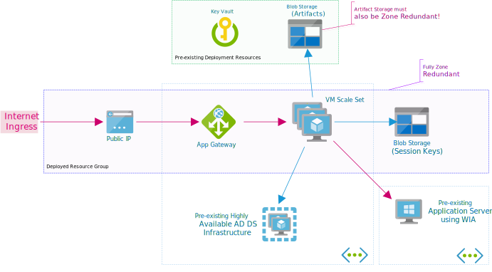

# Domain-joined VM Reference Architecture

This reference architecture is ideal for enterprises that need to enable modern authentication for one or more Windows Integrated Authentication applications (WIA). This architecture also supports all other authentication methods supported by OAKProxy, but it may be overkill if you don't need the Kerberos (WIA) authentication option.



This reference architecture is a 100% infrastructure as code model. All of the VMs use ephemeral disks. As such, they do not require any backup. The entire resource group can be destroyed and recreated from the ARM template.

## High Availability

The default deployment is highly available across 3 fault domains in a single data center. By enabling the `availabilityZones` option in the template the entire deployment can be zone redundant across 3 data centers in a region.

If you need redundancy across multiple Azure regions, deploy this template to multiple regions. The regions can be run behind shared host names using Azure Traffic Manager.

**Notice**: The artifact storage is a *runtime* dependency of the deployment. Whenever VMs are rebuilt or the scale set is scaled up, artifacts are pulled from the deployment blob storage. _If_ you use the `availabilityZones` option, your artifact storage account must also be a ZRS SKU for your deployment to be zone redundant. Key Vault is _not_ a runtime dependency. 

There are no sustained refences to Key Vault outside of deployment time by default. However, you may choose to reference the Key Vault in your OAKProxy configuration file to store application client secrets for example. In this case there is a dependency at startup time of the service (e.g. when a VM is built). Key Vault is always geo-redundant. 

## Networking Options

The reference architecture can be deployed for internal corporate network access only (private mode), presented to the internet with an Azure Application Gateway (public mode).

Public mode will deploy an Azure Application Gateway and expose an HTTPS endpoint on a public IP on the internet. OAKProxy should be configured to listen on an HTTP endpoint.

Private mode will deploy an internal network load balancer and expose an HTTPS endpoint on a private IP in the corporate network. OAKProxy must be configured to listen on an HTTPS endpoint in addition to HTTP. This mode can also be used if you need to build your own "public mode" using your own NVAs instead of Azure Application Gateway.


Internal mode uses 2 Standard Load Balancers. This is due to a requirement of _Standard_ Internal Load Balancers: a separate External Load Balancer is required for egress traffic to the internet. There is _no inbound rules configured_ on the External Load Balancer so no ingress connections from the public internet are possible through the public IP.

Egress traffic to the internet is only to facilitate access to Azure AD metadata endpoints and Azure blob storage. All direct outbound internet access can be removed using service endpoints, proxies, and NVAs and then the External Load Balancer is not required. This is beyond the scope of this reference architecture.

# Prerequisites

Most large enterprises will already have processes in place to provide these prerequisites. In case you have no pre-existing process or need more detail, some example administrative commands are provided in this section.

* A VNet on the corporate network routing domain (i.e. a "[VDC spoke](https://docs.microsoft.com/en-us/azure/architecture/vdc/)" or a VNet with a VPN or ExpressRoute gateway).
* An AD DS OU to place the server computer objects.
* An AD DS security group to contain the server computer objects.
* An AD DS account that can join VMs in the OU and update the group.
* An AD DS domain with a [KDS Root Key](https://docs.microsoft.com/en-us/windows-server/security/group-managed-service-accounts/create-the-key-distribution-services-kds-root-key) (to support the use of a gMSA).
* A gMSA account that will run the OAKProxy service on the domain VMs.
* A list of the SPNs for the Kerberos applications that OAKProxy will provide authentication services.
* A certificate trusted by your clients or publicly for all of the hostnames this deployment will handle. 
* A DNS zone where CNAME records for each proxied application can be created.
* An OAKProxy configuration file.
* An Azure Blob Storage container to store deployment artifacts.
* An OpenID Connect identity provider (Azure AD is recommended).
* (Recommended) An Azure Key Vault containing deployment secrets.

To simplify management and adding new applications, a wildcard certificate is recommended.

## Create the AD DS structure

First create the OU and security group. Ideally the OU has minimal Group Policy linked, but at least has policy to enforce highly restricted access to these VMs. Customize as appropriate for your domain management policies.

```powershell
$OUName = 'OAKProxy Servers'
$groupName = 'azoakservers'
$groupDescription = 'OAKProxy Cluster Servers'
$parentServerOU = 'OU=Privileged Servers,DC=corp,DC=contoso,DC=com'

$ou = New-ADOrganizationalUnit -Name $OUName -Path $parentServerOU -PassThru
$group = New-ADGroup -Name $groupName -Description $groupDescription -GroupScope Global -Path $ou.DistinguishedName
```

The account used with the ARM deployment to join the new VMs to the domain needs write access to the OU and security group. It is recommended to create a least privilege user account for this. The script below will create this user and give it permission to manage computer objects and group members within the new OU.

```powershell
$serverOU = 'OU=OAKProxy Servers,OU=Privileged Servers,DC=corp,DC=contoso,DC=com'
$accountName = 'xsoakproxymanage'
$parentUserOU = 'OU=Privileged Users,DC=corp,DC=contoso,DC=com'
$accountUpn = "$accountName@corp.contoso.com"
$credential = Get-Credential -UserName $accountName -Message 'Provide the password...'

$ou = Get-ADOrganizationalUnit -Identity $serverOU
$user = New-ADUser -Name $accountName -AccountNotDelegated $true -PasswordNeverExpires $true `
    -Path $parentUserOU -UserPrincipalName $accountUpn -Enabled $true `
    -AccountPassword $credential.Password -PassThru
$acl = Get-Acl -Path "AD:\$($ou.DistinguishedName)"
$securityIdentifier = [System.Security.Principal.SecurityIdentifier]::new($user.SID)
$schemaContext = (Get-ADRootDSE).SchemaNamingContext
$computerGuid = [System.Guid](Get-ADObject -SearchBase $schemaContext -LDAPFilter '(name=Computer)' -Properties schemaIDGUID).schemaIDGUID
$groupGuid = [System.Guid](Get-ADObject -SearchBase $schemaContext -LDAPFilter '(name=Group)' -Properties schemaIDGUID).schemaIDGUID
$memberGuid = [System.Guid](Get-ADObject -SearchBase $schemaContext -LDAPFilter '(name=Member)' -Properties schemaIDGUID).schemaIDGUID
$accessCreateDeleteChild = [System.DirectoryServices.ActiveDirectoryRights]::CreateChild -bor [System.DirectoryServices.ActiveDirectoryRights]::DeleteChild
$accessReadWriteProperty = [System.DirectoryServices.ActiveDirectoryRights]::ReadProperty -bor [System.DirectoryServices.ActiveDirectoryRights]::WriteProperty
$inheritanceDescendents = [System.DirectoryServices.ActiveDirectorySecurityInheritance]::Descendents
$fullControlComputers = [System.DirectoryServices.ActiveDirectoryAccessRule]::new($securityIdentifier, 'GenericAll', 'Allow', $inheritanceDescendents, $computerGuid)
$createDeleteComputers = [System.DirectoryServices.ActiveDirectoryAccessRule]::new($securityIdentifier, $accessCreateDeleteChild, 'Allow', $computerGuid, 'All')
$manageGroupMembers = [System.DirectoryServices.ActiveDirectoryAccessRule]::new($securityIdentifier, $accessReadWriteProperty, 'Allow', $memberGuid, $inheritanceDescendents, $groupGuid)
$acl.AddAccessRule($fullControlComputers)
$acl.AddAccessRule($createDeleteComputers)
$acl.AddAccessRule($manageGroupMembers)
Set-Acl -Path "AD:\$($ou.DistinguishedName)" -AclObject $acl
```

## Create the gMSA

Create the gMSA that will run the OAKProxy service and assign it to be used on the cluster. You will need the SPNs of the services that will receive connections via OAKProxy for this step.

```powershell
$groupName = 'azoakservers'
$accountName = 'oakproxygmsa'
$accountHostname = "${accountName}.corp.contoso.com"
$proxiedServiceSpns = @('http/billingapp','http/billingapp.corp.contoso.com', 'http/widgetsales.corp.contoso.com')

$group = Get-ADGroup -Identity $groupName
$serviceAccount = New-ADServiceAccount -Name $accountName `
    -PrincipalsAllowedToRetrieveManagedPassword $group `
    -DNSHostName $accountHostname -PassThru `
    -OtherAttributes @{'msDS-AllowedToDelegateTo' = $proxiedServiceSpns}
$serviceAccount | Set-ADAccountControl -TrustedToAuthForDelegation $true
```

## HTTPS Certificate

In both public or private access modes, you must provide a certificate for HTTPS. Modern authentication requires an HTTPS reply URL regardless of whether the application is internal to your network or not. 

In public mode, the certificate _must_ be specified in the `httpsCertificateData` template argument. This certificate will be installed in to the Application Gateway.

In private mode, the certificate _may_ be specified in the template. If the certificate is specified, it will be installed on the VMs and the gMSA account will granted access to use it. If you do not specify a certificate you should configure AD Certificate Services and a certificate autoenrollment GPO for the OAKProxy OU.

In either mode, the certificate is not required to be publicly trusted. You can use your internal certificate authority. Only the devices accessing the OAKProxy service need to trust the certificate. If devices that you do not configure with your CA root certificate access the service, you will need a publicly trusted certificate.

## OAKProxy Configuration

OAKProxy configuration is extensively documented with examples in the [OAKProxy documentation](https://github.com/wpbrown/oakproxy/blob/master/docs/README.md).

For this reference architecture _do not_ specify the `Server.KeyManagement` section in your configuration file. This is automatically configured on the VMs to use Azure Blob storage and DPAPI NG with access scoped to the gMSA account.

A minimal template for a public mode deployment follows:
```yaml
Server:
  Urls: 'http://*'
  UseForwardedHeaders: true
  EnableHealthChecks: true

IdentityProviders:
- # Your Identity Provider

Authenticators:
- # Your authenticators. For this reference architecture, at least 
  # one Kerberos authenticator would be expected.

Applications:
- # Your applications.

Configuration:
  ForwardedHeaders:
    ForwardedHostHeaderName: X-Original-Host
```

A minimal template for a private mode deployment follows. Applications and authentication will be served via HTTPS. The HTTP endpoint is retained to support the Load Balancer health probe. Standard Load Balancers support HTTPS health probes, but this architecture always uses HTTP in case a non-publicly trusted certificate is used. When using the 'Default'/single certificate configuration below, the certificate must have Subject Alternative Names for all the hostnames of the configured applications.

```yaml
Server:
  Urls: 'http://*;https://*'
  UseForwardedHeaders: true
  EnableHealthChecks: true

IdentityProviders:
- # Your Identity Provider

Authenticators:
- # Your authenticators. For this reference architecture, at least 
  # one Kerberos authenticator would be expected.

Applications:
- # Your applications.

Configuration:
  Kestrel:
    Certificates:
      Default:
        Subject: 'oakproxy.corp.contoso.com'
        Store: My
        Location: LocalMachine
```

## Artifact Storage

It's possible to deploy straight from GitHub without configuring the `_artifactsLocation` parameter, but this is not useful for any scenario other than a quick test. A secure storage account that is only writable by privileged accounts or a DevOps pipeline is recommended. 

This reference architecture follows a convention that lays out deployment artifacts exactly like GitHub releases. The convention is `<release-version>\oakproxy-windows.zip` for the service binaries and `refarch.djvm.<release-version>\oakproxyconfiguration.ps1.zip` for the VM DSC configuration. The release-versions are exactly as there appear in the [GitHub releases](https://github.com/wpbrown/oakproxy/releases). There is no convention for the OAKProxy configuration file, but it should be placed somewhere under `_artifactsLocation` as it will be requested with the `_artifactsLocationSasToken` if one is provided.

Example:
```bash
will@Azure:~$ az storage blob list --account-name contosodeploy --container oakproxy --query '[].name'
[
  "oakproxy-public-demo.yml",
  "oakproxy-private-demo.yml",
  "refarch.djvm.v1.0.0/oakproxyconfiguration.ps1.zip",
  "v0.3.0/oakproxy-windows.zip"
]
```

# Deployment

Once all the prerequisites are in place deployment is straightforward.

1. Populate the `azuredeploy.parameters.json`.

   Walk through the parameters and fill them in for your deployment.

   Name | Description
   --- | ---
   **adminUsername** | Username for the built-in Administrator of the VMs.
   **adminPassword** | Password for the built-in Administrator of the VMs.
   **domainJoinUsername** | Username for the account that has rights to join the VMs.
   **domainJoinPassword** | Password for the account that has rights to join the VMs.
   **domainName** | Fully qualified name of the AD DS domain to join the VMs.
   **domainOrganizationalUnit** | Distinguished name of the AD DS OU to join the VMs.
   **oakproxyServerGroupName** | Name of the AD DS security group to add the VMs.
   **oakproxyGmsaName** | Name of the AD DS gMSA that will run the OAKProxy service.
   instanceCount | Number of VMs in the cluster. (Default: 3)
   virtualNetworkResourceGroup | Name of the resource group that contains the virtual network to join the VMs. (Default: The deployment resource group)
   **virtualNetworkName** | Name of the virtual network to join the VMs.
   **virtualNetworkSubnetName** | Name of the subnet to join the VMs.
   domainHostNamePrefix | Prefix of the computer names in the VM scale set. (Default: `azoakserv`)
   hybridUseLicense | Use hybrid Windows licensing on the VMs. (Default: true)
   accessMode | Deploy for `Private` access on the intranet or `Public` access on the internet. (Default: `Public`)
   vmSize | The size to use for the VMs. (Default: Standard_D2s_v3)
   availabilityZones | Provide multiple zone numbers to create a zone redundant deployment. Set to `["1","2","3"]` to use all zones. (Default: [])
   **oakproxyVersion** | The version of OAKProxy to retrieve from the _artifactsLocations. Example: `v0.3.0`. (Default provided for testing only. Specify a value.)
   **vmConfigurationVersion** | The version of the VM configuration to retrieve from the _artifactsLocations. Example: `v1.0.0`. (Default provided for testing only. Specify a value.)
   **_artifactsLocation** | The base URI where artifacts required by this template are located including a trailing '/' (Default provided for testing only. Specify a value.)
   **_artifactsLocationSasToken** | The sasToken required to access _artifactsLocation.
   oakproxyConfigurationUrl | The full URL of the configuration file for OAKProxy. This is typically under the `_artifactsLocation`. The `_artifactsLocationSasToken` will be used if provided. (Default: `<_artifactsLocation>/oakproxy.yml`)
   applicationGatewayCapacity | The application gateway v2 capacity. (Default: 3)
   applicationGatewayDnsLabel | The DNS label for the application gateway public IP. (Required for `Public` access mode.)
   applicationGatewaySubnetName | Name of the subnet to install the application gateway. (Required for `Public` access mode.)
   httpsCertificateData | The HTTPS certificate for all of the hostnames using the proxy service. Provide a base64 encoded PFX file. (Required for `Public` access mode. Recommended for `Private` access mode.)
   httpsCertificatePassword | The password for the PFX file. (Required if `httpsCertificateData` is provided.)

2. Deploy the `azuredeploy.json` to an empty existing resource group. Note that mode `complete` will delete any resources in the resource group that are not specified in the template.
   
   ```bash
   will@Azure:~/oakproxy-deploy$ az group deployment create -g oakproxy-rg --template-file azuredeploy.json --parameters @azuredeploy.parameters.json --verbose --mode complete
   ```
   
3. Take note of the template output. 
   
   ```json
   "outputs": {
     "applicationGatewayDnsName": {
       "type": "String",
       "value": "contosoakproxy.eastus2.cloudapp.azure.com"
     },
     "applicationGatewayIpAddress": {
       "type": "String",
       "value": "20.36.254.133"
     }
   },
   ```

   For public deployments, update the public CNAME records for your proxied application hostnames to point to the FQDN in the `applicationGatewayDnsName` value. 

    ```json
    "outputs": {
      "internalLoadBalancerIpAddress": {
        "type": "String",
        "value": "10.3.2.9"
      }
    },
    ```

   For private deployments, update the private A records for your proxied application hostnames to point to the internal load balancer IP address in the `internalLoadBalancerIpAddress` value.

# DevOps Integration

Ongoing operations and maintenance of the service should follow a DevOps process. Assuming secrets have been stored in Key Vault, the 2 JSON documents above can be checked in to source control along with your OAKProxy configuration file. The original deployment process above can be rerun in a DevOps pipeline to ensure the entire service including the VM configuration is in the desired state. 

## External Dependencies

The maintenance of the AD DS objects will likely be integrated with an existing DevOps/Infrastructure-as-Code process for configuration of AD DS. In large organizations, this process may be owned by a completely different team than the one maintaining OAKProxy infrastructure.

### Computer Objects

Either the AD DS team or the team responsible for OAKProxy must add a process to their existing automation systems that purges old computer objects from the AD DS directory. The VM scale set will add new objects over time, especially if auto-scaling is enabled. As configured above the `xsoakproxymanage` account would have the privilege needed to delete the computer objects, so an OAKProxy team could automate this, however those responsible for AD DS will likely have more stake excess objects in AD DS so they may want to take responsibility for this process.

```powershell
$InformationPreference = 'Continue'
$oakproxyOU = 'OU=OAKProxy Servers,OU=Privileged Servers,DC=corp,DC=contoso,DC=com'
Connect-AzAccount -Identity # Assumes running in Azure with a managed identity

$hostnames = (Get-AzVmssVM -ResourceGroupName "oakproxy-rg" -VMScaleSetName "oakproxy-vmss").OsProfile.ComputerName
Get-ADComputer -Filter * -SearchBase $oakproxyOU |
    Where-Object { $_.Name -notin $hostnames } | 
    ForEach-Object { Write-Information -MessageData "Deleting $($_.Name)."; $_ } | 
    Remove-ADObject -Recursive -Confirm:$false
```

### Constrained Delegation ACL

The AD DS team should add code or a declaration in their source repository for maintaining the list of SPNs that delegate authentication to OAKProxy. This way the list can be updated using Infrastructure-as-Code in a deployment pipeline. 

Below is a PowerShell DSC example. This is just an example. Whatever DSC tool or imperative scripts you use are valid options.

```powershell
# Shared DSC Resources:
Configuration ConstrainedDelegationAnyProtocolTo
{
    param
    (
        [Parameter(Mandatory)]
        [string]$Source,

        [Parameter(Mandatory)]
        [string[]]$TargetSpns
    )

    Script EnableProxyDelegation {
        SetScript = {
            $principal = Get-ADObject -Filter {SAMAccountName -eq $using:Source}
            $principal | Set-ADAccountControl -TrustedToAuthForDelegation $true
            $principal | Set-ADObject -Add @{'msDS-AllowedToDelegateTo' = [string[]]$using:TargetSpns}
        }
        TestScript = {
            $TRUSTED_TO_AUTH_FOR_DELEGATION = 0x1000000
            $principal = Get-ADObject -Filter {SAMAccountName -eq $using:Source} -Properties 'msDS-AllowedToDelegateTo','userAccountControl'
            return ($null -ne $principal['msDS-AllowedToDelegateTo'].Value -and $null -eq (Compare-Object $principal['msDS-AllowedToDelegateTo'].Value $using:TargetSpns)) -and ($principal['userAccountControl'].Value -band $TRUSTED_TO_AUTH_FOR_DELEGATION)
        }
        GetScript = {
            $principal = Get-ADObject -Filter {SAMAccountName -eq $using:Source} -Properties 'msDS-AllowedToDelegateTo','userAccountControl','samAccountName'
            return @{
                Result = $principal | ConvertTo-Json
            }
        }
    }
}

# Snippet from the AD DS Domain desired state configuration:
$allProdTargetSpns = @('http/billingapp', 'http/billingapp.contoso.com', 'http/widgets.corp.contoso.com')

xADManagedServiceAccount OakproxyGmsaExists {
    ServiceAccountName = 'oakproxygmsa'
    AccountType = 'Group'
    Members = @('azoakservers')
}

ConstrainedDelegationAnyProtocolTo OakproxyGmsaKcdEnabled {
    Source = 'oakproxygmsa$'
    TargetSpns = $allProdTargetSpns
    DependsOn = '[xADManagedServiceAccount]OakproxyGmsaExists'
}
```
