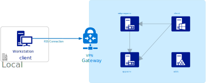

\*\* This sub-project is in the process of being migrated/rebuilt in to the [Azure Enterprise Lab](https://github.com/wpbrown/azentlab). \*\*

# The Lab
The `lab.json` and `labconfig.ps1` files make it easy to deploy a fully functional dev/test environment for oakproxy (or any other AD DS work) in Azure.



## Contents
A Server 2016 AD DS domain controller with 2 additional Server 2016 servers and 1 Windows 10 client are deployed. All configuration is done with PowerShell DSC in auto-correct mode. Changes to any of the original configuration will be reverted by DSC unless the DSC configuration document is updated or the LCM configuration is changed.

### Domain Computers
* **addc** - Domain Controller.
* **appserv** - Hosts the testapp website on IIS and a file server. Shares `\\appserv\lab` and `\\appserv\scratch` are precreated. These can be mounted by any user in the lab and over VPN for easy transfer in and out of the lab.
* **oakproxyserv** - Server for dev/test of OAKProxy. You may want to resize this VM to a more powerful sku during development.
* **client** - Representative end-user machine. This machine is preconfigured to the recognize local domain for SSO. If you login as `user1` and open a browser to `http://testapp/`, Windows Authentication SSO should work out of the box.

### Domain Users
* **xoda** ($adminPassword) - Domain admin. Also the "local admin" of the domain controller.
* **xsoakproxy** ($userPassword) - This account is preconfigured for impersonation to the `http://testapp` running on `appserv`.
* **user1** ($userPassword) - Example domain user 1.
* **user2** ($userPassword) - Example domain user 2.

### Local Users
* **localadmin** ($adminPassword) - The local admin on appserv, oakproxyserv, and client. 

## Template Parameters
Name | Default | Description
--- | --- | ---
**adminPassword** | *required* | Password for the domain admin (xoda) and local admins (localadmin).
**userPassword** | *required*  | Password for the domain user (user1, user2) and service accounts (xsoakproxy).
**domainName** | contoso.com | Name of the lab AD DS domain.
**domainNetbiosName** | contoso | Netbios name of the lab AD DS domain.
**sourceIp** | *optional* | Allow access to the lab environment from this IP. (optional: A VPN gateway is created if an IP is not provided)
**dnsPrefix** | *optional* | Unique prefix for public DNS names of the VMs. (required only if 'sourceIp' is provided)
**vpnCaCert** | *optional* | If using VPN gateway to connect to the lab, provide a CA cert. (optional: This can be done in the portal later)
**shutdownTime** | 2000 | Time to shutdown the lab (default 8:00 PM).
**shutdownTimezone** | Eastern Standard Time | Timezone for shutdown time.
**shutdownAlertMail** | *optional* | Email to alert before shutdown.
**vmSize** | Standard_A2_v2 | Default compute sku for all VMs.
**diskSku** | StandardSSD_LRS | Default managed disk sku for all VMs.
**artifactsUrl** | [lab_artifacts](https://github.com/wpbrown/oakproxy/releases/download/lab_artifacts) | Base URL to DSC configuration artifacts.

## Network Modes
You can either provide the `sourceIp` parameter for Public IP mode or leave it empty for VPN mode. If you provide the `sourceIp` you must also provide `dnsPrefix`. 

### Public IP Mode
Public IPs will be attached to each machine and an NSG will be applied to all machines that only allows ingress to the lab via RDP from `sourceIp`. If your IP changes you need to update the NSG rule.

### VPN Mode
A Virtual Network Gateway will be provisioned. If you provide `vpnCaCert` it will be installed. There are no public IPs in the lab and no NSG is provisioned. All access is via VPN and all traffic is allowed from the VPN client.

This is much more convenient for remote debugging and testing, although there is a cost for the VPN to be enabled. The 'Basic' sku is deployed to reduce cost.

### VPN Configuration
If you don't have a certificate to supply to `vpnCaCert` you can follow the docs for [PowerShell](https://docs.microsoft.com/en-us/azure/vpn-gateway/vpn-gateway-certificates-point-to-site), [StrongSwan](https://docs.microsoft.com/en-us/azure/vpn-gateway/vpn-gateway-certificates-point-to-site-linux), or my instructions for [OpenSSL](https://github.com/wpbrown/oakproxy/wiki/Azure-VPN-with-OpenSSL-CA).

After deployment you can download the VPN client like so:
```Shell
$ url=$(az network vnet-gateway vpn-client generate -g "domainlab-rg" -n "lab-vgw" -o "tsv")
$ wget -O vpn.zip "$url"
```

## Deploying
If you want to use VPN mode and you followed my OpenSSL procedure you can get your CA cert data like below. Otherwise populate CACERTDATA with your x509 certificate data string.
```Shell
$ CACERTDATA=$(cat pki/ca.crt | head -n -1 | tail -n +2 | tr -d '\n')
```
A simple VPN deployment:
```Shell
$ az group create -n "domainlab-rg" -l "eastus2"
$ az group deployment create -n "labdeployment" -g "domainlab-rg" --template-file "lab.json" \ 
  --verbose --mode "Complete" --parameters "vpnCaCert=$CACERTDATA" \
  "adminPassword=UpperLower$12" "userPassword=LowerUpper$12"
```
Or a Public IP deployment:
```Shell
$ az group deployment create -n "labdeployment" -g "domainlab-rg" --template-file "lab.json" \ 
  --verbose --mode "Complete" --parameters "sourceIp=1.2.3.4" "dnsPrefix=unique25721" \
  "adminPassword=UpperLower$12" "userPassword=LowerUpper$12"
```

If you intend to synchronize the domain with Azure AD, you should provide a public domain name that you own rather than the default `contoso.com`.

Depending on the size of the VMs the infrastructure can take about 45 minutes to fully deploy and configure. The Virtual Network Gateway takes about 30 minutes.

## Tips
When remotely connecting to the machines be sure to always correctly specify the machine (e.g. `localhost\localadmin`) or domain (e.g. `contoso\xoda`) when signing in.

### Additional Customizations
Some additional things I do in the lab:
* Install Azure AD Connect on `appserv` and sync the lab domain to a lab Azure AD tenant.
* Install Visual Studio and Sysinternals tools on `oakproxyserv`.
* Map the ``\\appserv\lab`` share to a drive on `oakproxyserv` and `client`.

### Mounting the Lab Share
When connecting the lab share from outside the domain (i.e. from your client over VPN), browsing to the file server won't work. Be sure to map the share to a drive, fully specify the share (e.g. `\\appserv.contoso.com\lab`) and provide domain credentials (e.g. `contoso\user1`).

### Networking Issues
Depending on your client operating system configuration the remote DNS may or may not work over the VPN. If you do not configure your machine to forward to the remote DNS for your domain name, you will need to use IP addresses to access the VMs from your client. It works out of the box on Windows 10 for me.

If your local network address space conflicts with 10.0.0.0/15, then you will need to modify the network address spaces in the tempplate to use VPN mode.

# Testapp
A bare minimum .NET Framework 4.6.1 ASP.NET application. It is meant to represent a legacy web application running in an AD DS environment. The application is meant to be run with Windows Authentication under IIS. It only has 2 paths. `GET /` returns a simple HTML page and `GET /api` which returns a JSON document with authenticated user information.

This is the source for `testapp.zip` in the [lab_artifacts release](https://github.com/wpbrown/oakproxy/releases/tag/lab_artifacts). This is automatically deployed to the "The Lab" above.

# Testimper
A testing tool with .NET Framework and .NET Core builds to test Kerberos S4U2Self impersonation. It has options to use WinHttp or the new SocketsHandler in .NET Core and to manipulate whether the TCB and Impersonation privileges are enabled. Example output [here](https://github.com/wpbrown/oakproxy/blob/master/testenv/testimper/output.log).

# Testasync
A .NET Core app for testing async and impersonation. It demonstrates that the impersonation context is being migrated to the thread by the Async execution context. Example output [here](https://github.com/wpbrown/oakproxy/blob/master/testenv/testasync/output.log).
